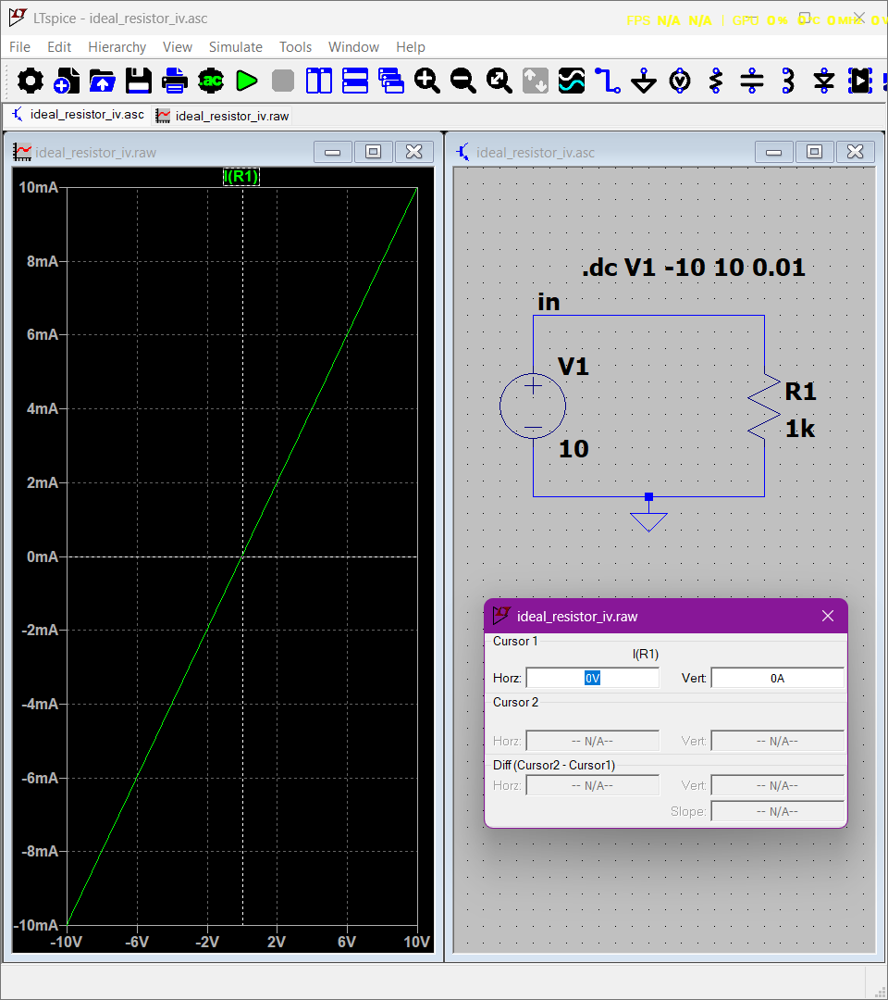

# Experiment 01.01.01: Ideal Linear Resistor I–V Characterization

## 1. Overview & Theoretical Background
This experiment analyzes the fundamental $I\text{--}V$ relationship of an ideal linear resistor ($R_1 = 1\,\text{k}\Omega$) across a symmetric voltage sweep. According to Ohm's Law, the current flowing through an ideal resistor is directly proportional to the applied voltage across its terminals:

$$I = \frac{V}{R_1}$$

The slope of the $I\text{--}V$ characteristic curve represents the equivalent circuit conductance ($G$):

$$G = \frac{dI}{dV} = \frac{1}{R_1} = \frac{1}{1000\,\Omega} = 1\,\text{mS}$$

---

## 2. Circuit Configuration & Netlist

The test bench consists of a single-loop circuit with an independent DC voltage source ($V_1$) driving a $1\,\text{k}\Omega$ resistor ($R_1$) referenced to ground (Node `0`).

### SPICE Netlist (`ideal_resistor_iv.net`)
```spice
* C:\Users\AMAL MADHU\Projectz_101\LTspice-Circuit-Lab\01_Basic_Electronics\01_Linear_Resistor\01_Ideal_Resistor\ideal_resistor_iv.net
* Generated by LTspice 24.1.10 for Windows.
V1 in 0 10
R1 in 0 1k
.dc V1 -10 10 0.01
.backanno
.end
```

---

## 3. Active Simulation Directive
* **Directive:** `.dc V1 -10 10 0.01`
* **Purpose:** Sweeps $V_1$ continuously from $-10\,\text{V}$ to $+10\,\text{V}$ in steps of $10\,\text{mV}$. This produces a continuous curve evaluating $I(R_1)$ in all four operating quadrants.

---

## 4. Visual Results & Plot Verification
Below is the simulated $I\text{--}V$ characteristic curve exported from LTspice showing linear conductance passing directly through the origin:



---

## 5. Quantitative Verification: Hand Calculations vs. SPICE

| Sweep Input $V_1$ (V) | Theoretical $I(R_1) = \frac{V_1}{1\,\text{k}\Omega}$ | SPICE Simulated $I(R_1)$ | Power $P = \frac{V_1^2}{R_1}$ (mW) | Relative Error (%) |
| :---: | :---: | :---: | :---: | :---: |
| $-10.0$ | $-10.00\,\text{mA}$ | $-10.00\,\text{mA}$ | $100.0\,\text{mW}$ | $0.00\%$ |
| $-6.0$ | $-6.00\,\text{mA}$ | $-6.00\,\text{mA}$ | $36.0\,\text{mW}$ | $0.00\%$ |
| $-2.0$ | $-2.00\,\text{mA}$ | $-2.00\,\text{mA}$ | $4.0\,\text{mW}$ | $0.00\%$ |
| $0.0$ | $0.00\,\text{mA}$ | $0.00\,\text{mA}$ | $0.0\,\text{mW}$ | $0.00\%$ |
| $+2.0$ | $+2.00\,\text{mA}$ | $+2.00\,\text{mA}$ | $4.0\,\text{mW}$ | $0.00\%$ |
| $+6.0$ | $+6.00\,\text{mA}$ | $+6.00\,\text{mA}$ | $36.0\,\text{mW}$ | $0.00\%$ |
| $+10.0$ | $+10.00\,\text{mA}$ | $+10.00\,\text{mA}$ | $100.0\,\text{mW}$ | $0.00\%$ |

---

## 6. Methodological Justification for Omitted Analyses
To maintain rigor, additional SPICE simulation domains were systematically evaluated and excluded based on the following physical and mathematical reasons:

* **Transient Analysis (`.tran`):**
  * **Reason for Exclusion:** An ideal SPICE resistor model contains zero parasitic capacitance ($C = 0\,\text{F}$) and zero parasitic inductance ($L = 0\,\text{H}$). The voltage-to-current response is instantaneous ($t_{\text{response}} = 0\,\text{s}$). Running a time-domain transient sweep yields no dynamic energy storage effects or transition delays.

* **AC Small-Signal Frequency Sweep (`.ac`):**
  * **Reason for Exclusion:** The complex impedance of an ideal resistor is pure real: $Z(s) = R_1 + j0$. Because $Z(s)$ is independent of frequency ($\omega$), sweeping frequency from $1\,\text{Hz}$ to $100\,\text{MHz}$ produces a flat $0\,\text{dB}$ magnitude and $0^\circ$ phase response across the entire spectrum.

* **Standalone DC Operating Point (`.op`):**
  * **Reason for Exclusion:** A `.op` command computes a static single-point bias solution (e.g., at $V_1 = 10\,\text{V}$). Because the `.dc` sweep continuously evaluates all operating points between $-10\,\text{V}$ and $+10\,\text{V}$, the static point at $10\,\text{V}$ is already subsumed within the DC sweep data.

* **Temperature Parameter Sweep (`.step temp`):**
  * **Reason for Exclusion:** By default, standard SPICE resistor models carry zero temperature coefficients ($\text{TC}_1 = 0, \text{TC}_2 = 0$). Resistance remains strictly $1\,\text{k}\Omega$ regardless of ambient temperature changes unless explicit model parameters are specified.
