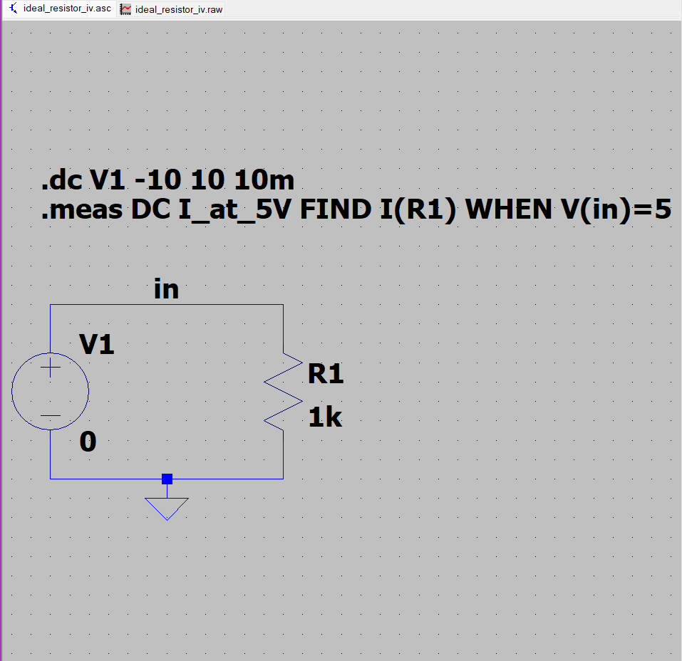
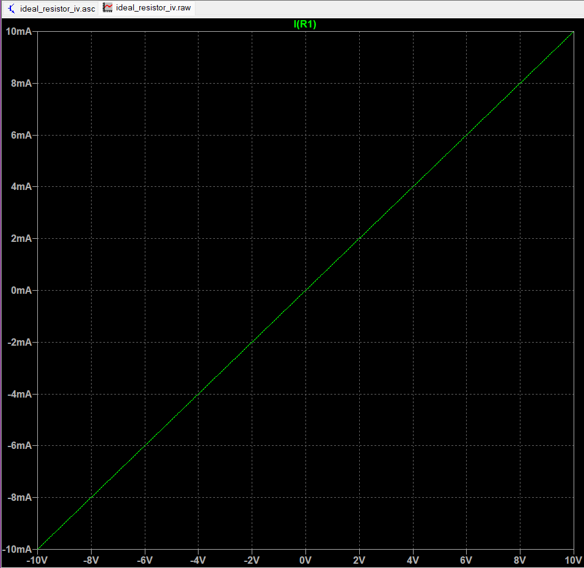
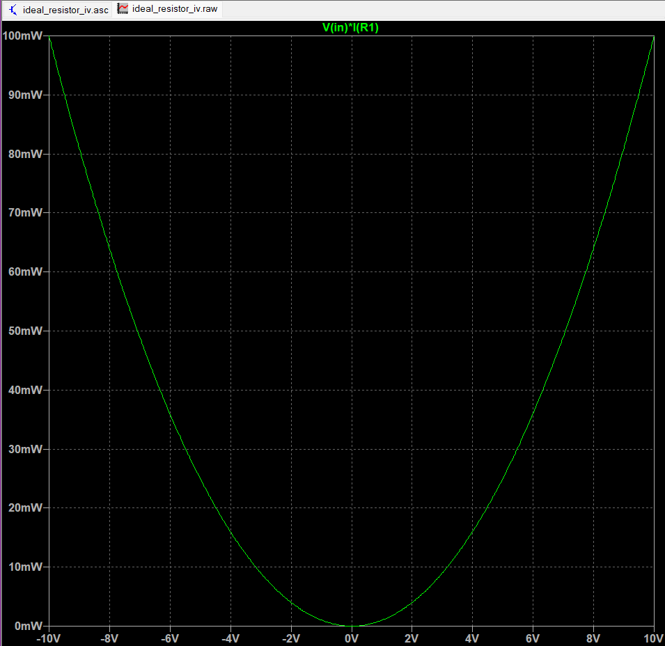

# Experiment 01: Ideal Linear Resistor

## Objective

Characterize the current–voltage behaviour of an ideal linear resistor and verify the result against hand calculation and an LTspice DC sweep.

## Circuit

The circuit contains a voltage source `V1` and a `1 kΩ` resistor `R1` connected between node `in` and ground. The current reference is `I(R1)` from node `in` through the resistor to ground.



## Parameters

| Parameter | Value |
| --- | ---: |
| Resistance `R1` | `1 kΩ` |
| DC sweep source | `V1` |
| Sweep range | `−10 V` to `+10 V` |
| Sweep increment | `10 mV` |
| Evaluation point | `V(in) = 5 V` |

## Theory

For an ideal resistor,

\[
I = \frac{V}{R}, \qquad G = \frac{1}{R}, \qquad P = VI = \frac{V^2}{R}.
\]

With `R = 1 kΩ`, the expected conductance and I–V slope are `1 mS`. At `V = 5 V`, the analytical current is `5 mA` and the analytical power is `25 mW`.

## LTspice analysis

The experiment uses the minimum analysis set needed to answer the static I–V question:

```spice
.dc V1 -10 10 10m
.meas DC I_at_5V FIND I(R1) WHEN V(in)=5
```

The schematic and generated netlist are stored in [`simulation/`](simulation/):

- [`ideal_resistor_iv.asc`](simulation/ideal_resistor_iv.asc)
- [`ideal_resistor_iv.net`](simulation/ideal_resistor_iv.net)

Generated `.raw`, `.log`, and `.db` files are intentionally excluded from the publication set.

## Results

The LTspice waveform shows a straight-line voltage sweep and a straight-line resistor current, confirming the ideal linear model.





The LTspice measurement log reports:

```text
i_at_5v: I(R1)=0.00499999988824 at 5
```

Therefore,

```text
I_SPICE = 4.99999988824 mA
```

## Analytical versus SPICE comparison

| Quantity | Analytical | LTspice | Interpretation |
| --- | ---: | ---: | --- |
| Current at `5 V` | `5.00000000000 mA` | `4.99999988824 mA` | Agreement to numerical precision |
| Absolute current difference | — | approximately `0.11176 nA` | Solver/display precision |
| Relative current difference | — | approximately `2.24 × 10⁻⁶ %` | Negligible for this ideal model |
| Power at `5 V` | `25 mW` | Consistent with `V(in)·I(R1)` | Quadratic voltage dependence |

The difference is not a physical modelling error. It is consistent with numerical representation and solver precision in the ideal model.

The detailed derivation is in [`calculations/hand_calculation.md`](../calculations/hand_calculation.md) and [`calculations/hand_calculation.pdf`](../calculations/hand_calculation.pdf). The formal report is in [`documentation/experiment_report.pdf`](../documentation/experiment_report.pdf), with editable source in [`documentation/experiment_report.tex`](../documentation/experiment_report.tex) and bibliography data in [`documentation/references.bib`](../documentation/references.bib).

## Engineering insight

The ideal resistor establishes the baseline conventions for this laboratory: current direction, voltage polarity, units, analysis selection, numerical measurement, and analytical comparison. Later experiments will extend this baseline to resistor combinations, tolerance and Monte Carlo methods, temperature coefficient, thermal noise, parasitics, and nonlinear modelling.

## Limitations

This experiment does not model tolerance, temperature coefficient, voltage coefficient, power coefficient, parasitic inductance or capacitance, or physical resistor noise. Those effects belong in the later practical-resistor and advanced-analysis experiments.

## Reproducibility record

| Item | Record |
| --- | --- |
| Simulator | LTspice x64 `24.1.10` for Windows |
| Primary analysis | `.dc` sweep |
| Measurement | `.meas DC I_at_5V FIND I(R1) WHEN V(in)=5` |
| Simulation artefacts | `simulation/ideal_resistor_iv.asc`, `simulation/ideal_resistor_iv.net` |
| Visual evidence | `assets/schematic.png`, `assets/iv_curve.png`, `assets/power_curve.png` |
| Report date | `19 August 2026` |
