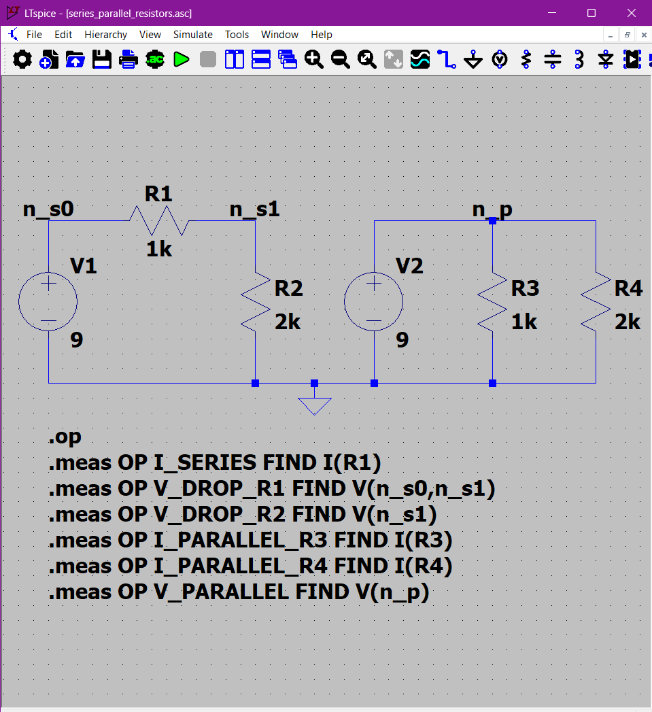
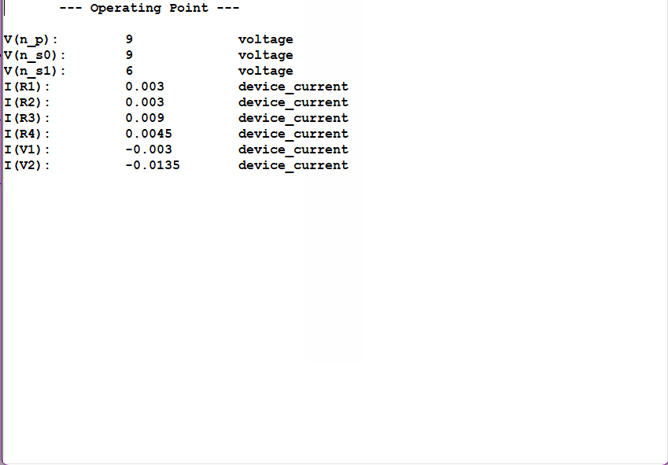
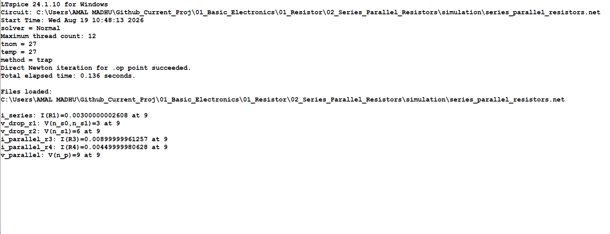

# Experiment 02: Series and Parallel Resistors

## Objective

Verify the equivalent-resistance rules for series and parallel resistor networks, including voltage division, current division, Kirchhoff's voltage law, and power distribution.

## Circuit under test

The LTspice schematic contains two independent `9 V` DC networks sharing only the ground reference.

| Network | Components | Main question |
| --- | --- | --- |
| Series | `V1 = 9 V`, `R1 = 1 kΩ`, `R2 = 2 kΩ` | Does the same current flow through both resistors, and do the voltage drops sum to the source voltage? |
| Parallel | `V2 = 9 V`, `R3 = 1 kΩ`, `R4 = 2 kΩ` | Do both branches have the same voltage, and does source current equal the sum of branch currents? |



## Analytical baseline

For the series network,

\[
R_{eq,s}=R_1+R_2=3\,\mathrm{k\Omega},
\qquad
I_s=\frac{9\,\mathrm{V}}{3\,\mathrm{k\Omega}}=3\,\mathrm{mA}.
\]

The expected voltage drops are `3 V` across `R1` and `6 V` across `R2`, and the total power is `27 mW`.

For the parallel network,

\[
R_{eq,p}=\frac{R_3R_4}{R_3+R_4}=666.6667\,\Omega.
\]

Both resistors have `9 V` across them. The expected branch currents are `9 mA` through `R3` and `4.5 mA` through `R4`, giving `13.5 mA` total current and `121.5 mW` total power.

The detailed derivation is in [`calculations/hand_calculation.md`](calculations/hand_calculation.md).

## LTspice analysis

The question is a DC operating-point problem, so the experiment uses `.op` and numerical measurements rather than transient or AC analysis.

```spice
.op
.meas OP I_SERIES FIND I(R1)
.meas OP V_DROP_R1 FIND V(n_s0,n_s1)
.meas OP V_DROP_R2 FIND V(n_s1)
.meas OP I_PARALLEL_R3 FIND I(R3)
.meas OP I_PARALLEL_R4 FIND I(R4)
.meas OP V_PARALLEL FIND V(n_p)
```

The LTspice files are stored in [`simulation/`](simulation/):

- [`series_parallel_resistors.asc`](simulation/series_parallel_resistors.asc)
- [`series_parallel_resistors.net`](simulation/series_parallel_resistors.net)

Transient `.raw`, `.log`, and `.db` outputs are intentionally excluded.

## Evidence





The measured results are:

```text
I(R1) = 0.003000000002608 A
V(n_s0,n_s1) = 3 V
V(n_s1) = 6 V
I(R3) = 0.008999999961257 A
I(R4) = 0.004499999980628 A
V(n_p) = 9 V
```

These agree with the analytical values to numerical solver precision. The series current is common to both series elements, the voltage drops satisfy KVL, both parallel branches have the source voltage, and branch currents sum to the source current.

## Analytical versus LTspice comparison

| Quantity | Analytical | LTspice | Interpretation |
| --- | ---: | ---: | --- |
| Series current | `3.000000 mA` | `3.000000002608 mA` | Numerical-precision agreement |
| Series drop across `R1` | `3.000000 V` | `3.000000 V` | KVL voltage division verified |
| Series drop across `R2` | `6.000000 V` | `6.000000 V` | KVL voltage division verified |
| Parallel current through `R3` | `9.000000 mA` | `8.999999961257 mA` | Current division verified |
| Parallel current through `R4` | `4.500000 mA` | `4.499999980628 mA` | Current division verified |
| Parallel node voltage | `9.000000 V` | `9.000000 V` | Equal branch voltage verified |

## Engineering insight

Series and parallel rules are not merely algebraic shortcuts. They express circuit topology and conservation laws. Series elements share current and divide voltage according to resistance; parallel elements share voltage and divide current inversely according to resistance. These concepts become essential when analysing bias networks, current mirrors, differential pairs, feedback networks, sensor interfaces, and power-distribution paths in mixed-signal and embedded systems.

## Limitations

The experiment uses ideal resistor models and independent ideal voltage sources. It does not include tolerance, temperature coefficient, parasitic impedance, source resistance, or measurement loading. Those effects belong in the later tolerance, temperature, noise, and practical-model experiments.

## Reproducibility record

| Item | Record |
| --- | --- |
| Simulator | LTspice x64 `24.1.10` for Windows |
| Primary analysis | `.op` operating point |
| Source values | `V1 = 9 V`, `V2 = 9 V` |
| Resistance values | `R1/R3 = 1 kΩ`, `R2/R4 = 2 kΩ` |
| Evidence | `assets/schematic.png`, `assets/operating_point.png`, `assets/measurement_log.png` |
| Report status | Calculation record and formal report to be added before commit |
